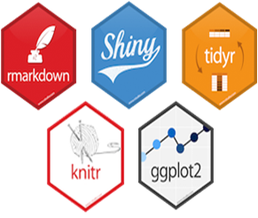

```{r setup, include=FALSE}
knitr::opts_chunk$set(echo = TRUE,
                      warning = FALSE,
                      message = FALSE,
                      comment = NA)
```


```{r, echo=FALSE, message=FALSE, warning=FALSE, fig.align='center'}


```


## 1. Introdução

### Dedicado ao Augusto Boal e ao DMQ

> A escola é o lugar para a construção e vivência de experiencias e valores significativos (Leandro Karnal).

> Importante na escola não é só estudar. É também criar laços de amizade, É criar ambiente de camaradagem. É conviver, é se “amarrar nela” (Paulo Freire)

Esse texto é dedicado aos estudantes de estatística da UNIRIO e aos meus (espetaculares) colegas de departamento. Minha convivência com eles (estudantes e professores) me ajudou a perceber que um curso de estatística para uma turma de administração pública precisa ser muito mais do que fórmulas, questões de livros e aplicação de provas.

Essa minha experiência com eles me diz que há uma necessidade real de mostrar como a disciplina de estatística é uma parte essencial do currículo profissional dos novos gestores públicos. Isso me fez tentar traduzir as fórmulas matemática da área da estatística em objetivos pedagógicos aplicados. Assim, esse texto é o resultado da minha abordagem pessoal aos conceitos desenvolvidos no coração do Departamento de Métodos Quantitativos da UNIRIO.

Assim, começo dizendo que tentei mudar o modo que a estatística fosse percebida pelos estudantes. Busquei fazê-la de forma totalmente aplicada. Tentei mostrá-la como uma importante ferramenta da administração pública. Acredito que isso leva a uma melhor integração da teoria com a prática de uma forma que não encontrada em um curso de graduação.

Nessa abordagem, o objetivo não era conseguir encontrar o valor correto de uma conta/cálculo de estatística, mas sim utilizar o método quantitativo como um instrumento para orientar o processo de tomada de decisão na administração pública. Acredito que, desse modo, o estudante não só aprenderá a estatística, mas deverá preservar o pensamento estocástico e reconhecer como e quando aplicar esses conceitos na sua vida profissional décadas depois de passar por esse semestre.

Essa abordagem levanta perguntas científicas que são interessantes e eles contêm conjuntos de dados para uso em endereçamento essas perguntas. O contexto da questão científica é o ponto de partida para o desenvolvimento da teoria estatística (Nolan,D. and Speed,T.P.; 1999).

O modelo proposto aqui é projetar casos de ensino com problemas de pesquisa que tem contexto com maior profundidade do que a maioria dos textos estatísticos, possibilitando investigações e análises no contexto de um problema científico, e desenvolvimento teórico detalhado dentro da sala de aula. Um objetivo importante dessa abordagem é incentivar e desenvolver o pensamento estatístico. Como resultado, a avaliação foi completamente reestruturada. Por exemplo, o trabalho a ser apresentado ao final do curso inclui análises de dados de questões abertas e incluem trabalho em grupo e discussões sobre os estudos de caso.

Assim, com as aulas tradicionais de Estatística Matemática pode ser difícil para os(as) alunos(as) fazer a transição da leitura e compreensão de uma análise estatística em um livro didático para trabalhar com a Estatística em sua pesquisa, no seu TCC ou na sua vida profissional.

Assim, coloquei descrições detalhadas dos dados para colocar o problema em contexto, e sugestões de como proceder na análise.  Isso permitiu que o caso de ensino a peça central do curso de pensamento estatístico, não só um acompanhamento secundário das demostrações de fórmulas.

Como resultado dessa reestruturação visando os casos de ensino, várias mudanças ocorreram no curso. O formato das avaliações mudou. Mais tempo foi gasto para determinar como tomar decisão orientada a dados com análises estatísticas e sobre a construção de um método estatístico para sua aplicação em um problema específico. Assim, o um tempo menor foi gasto cobrindo a demostração de fórmulas para ilustrar uma técnica estatística.

#### O funcionário Johnnson e o professor João

Os casos apresentado aqui foram desenvolvidos a partir do livro de PETERS e GRAY (1994). Este livro apresenta dezoito casos de problemas de gestão resolvidos com a estatística e deve ser visto como a fonte primária (e complementar) desse texto. Só para dar um exemplo, o protagonista Johnson do caso de discriminação racial corporativa (*employee discrimination*) foi traduzido em um caso de racismo do professor João da Escola Oliveira Ltda.

#### O valor correto pouco útil da aplicação das formulas de estatística *que o computador faz para gente*.

Não é que a abordagem de aplicação de formulas e fazer contas estatística "na mão" seja inútil. O que estou querendo dizer é que o estudante não vai fazer mestrado em estatística e muitas vezes buscar o valor correto de uma conta estatística que o R ou o Python faz de forma automática será de pouca importancia para um futuro gestor. Assim, o(a) aluno(a) estuda para passar na prova e depois esquece desse conteúdo.

Os livros didáticos tradicionais de estatística buscam enfatizar o processo de encontrar a resposta certa em um determinado intervalo de confiança (95% ou 99% de confiança). Muitas vezes, essa abordagem não tem nenhum contexto do motivo para a construção desse intervalo. Esse tipo de método tende a valoriza o cálculo e a memorização das fórmulas. O objetivo geralmente é a aplicação correta de procedimentos estatísticos para encontrar a resposta numérica correta. Neste caso, o limite inferior e superior do intervalo de confiança. Você sabe o que estou dizendo. Todos nós passamos por isso como alunos e como professores.

Na abordagem por caso de ensino, no lugar do objetivo ser conseguir a resposta correta em uma aplicacao das contas e análise estatística, o objetivo, muitas vezes, é entender a situação problema da gestão pública e resolver um problema real no processo de tomada de decisão em situações tipicas da administração/gestão.

Neste projeto, busco dar aos estudantes a oportunidade de trabalhar com um caso de estudo representativo do mundo real que exige do estudante a identificação do problema a ser abordado, bem como indentificar quais são as informações relevantes e não relevantes. De forma ainda mais clara: esta abordagem precisa que o estudante "mergulhe direto nos dados" para definir o problema, desenvolver alternativas de gestão e recomendar uma solução. 


#### A famosa pergunta: PARA QUE TENHO QUE APRENDER ISSO?

> I have no data yet. It is a capital mistake to theorize before one has data.(Sherlock Holmes)
> Eu não tenho dados ainda. É um erro capital teorizar antes de se ter dados. (Sherlock Holmes)

Acredito que esse destaque todo na busca pela resposta numérica correta falha com a importante contribuição que a estatistica pode dar ao processo de tomada de decisão pelo gestor público. PETERS e GRAY (1994) afirmam que se buscarmos a resposta correta do estudante, falhamos em entender o motivo pelo qual o conhecimento estatístico pode ser útil na area de administração (como conhecimento estatístico deve ser utilizado). Os autores também dizem que falhamos em entender como esse conhecimento pode ajudar no processo de tomada de decisão em situações administrativas do mundo real. E completam: falhamos em mostrar o valor do conhecimento estatístico e isso sempre levará ao alunx a questionar a relevancia da estatística para a sua área (não poderia concorda mais com eles).

#### Para além da estatística

No lugar de encontrar a resposta numérica correta em uma prova de estatistica, o uso desta metodologia permite ao aluno não só estudar a Estatística em si, mas também aprender a programar na linguagem R, bem como adquirir experiência em uso de bancos de dados, planilhas, apresentações, e arquivos Markdown (arquivos para uso na web). Acredito que assim ele estará mais preparado para a vida cidadã, para a vida acadêmica, e para a sua vida profissional.

> Entender Estatística é essencial aos cidadãos das sociedades atuais: para ser crítico em relação à informação disponível na sociedade, para entender e comunicar com base nessa informação, mas, também, para tomar decisões, uma vez que uma grande parte da organização dessas mesmas sociedades tem por base esses conhecimentos. (Shaughnessy, 1992, 1996).

Em resumo, a vivência com os professores do DMQ e o livro do PETERS e GRAY (1994) me fizeram perceber que seria muito interessante abrir mão da aplicação do cálculo numérico correto em uma prova em favor do conceito e da interpretação da estatística no mundo real.

Mariano Pimentel e Felipe Carvalho (2021) afirmam que há um equívoco entre o ato de avaliar e o ato de examinar. De acordo com eles, examinar é uma atividade pontual, efetivada por prova, realizada com a finalidade de classificar se o aluno sabe/não sabe determinados conteúdos, com vista a selecionar quem passa na disciplina, quem entra na universidade. Já a avaliação é uma atividade realizada continuamente ao longo das aulas, por meio de diferentes instrumentos, com a finalidade de investigar e produzir pistas, indicativos ou diagnósticos que possibilitem ao professor decidir o que deve fazer para apoiar o aluno a aprender.

O ato de examinar efetivada por prova valoriza uma leitura mecânica. Isto é, porque assim o desafio passa a ser a memorização do texto. Se o estudante consegue decorar, terá respondido ao desafio da disciplina.

Leandro Karnal diz algo parecido em seu livro. Ele descreve uma situação em que substitui um outro professor de filosofia. Diz ele:

> A pergunta da prova geralmente é parecida com à dada em sala de aula. Apesar de apenas trabalhar com a memória, o método tem um certo prestigio com os alunos. **a prova seria exatamente o esperado**. Fácil, seguro e quase inutil na minha visão. Ninguém achava aquelas informações úteis ou interessantes (Leandro Karnal p. 54).

De forma oposta à prova, nesta abordagem busco o ato de avaliar. Isto é, o desenvolvimento de um projeto autoral (CARVALHO;PIMENTEL, 2020) para promover o letramento em Estatística e a capacidade de criar discursos em estatística para atuar no mundo. Nesse sentido, os alunos utilizam os conceitos para criar o discurso em estatística.

Tento criar tanto nas aulas quanto na avaliação um espaço para praticar o diálogo com objetivo de desenvolver discursos em Estatística. Também tento perceber como os estudantes estão empregando o vocabulário da linguagem Estatística.  Assim. a linguagem de programação R permite que o processo de estudo da estatística deixa de ser apenas um técnica e passa a ser parte do processo de construção do conceito.

Este é o resultado.

### 1.1. Objetivo

Este capítulo tem como objetivo apresentar um projeto autoral de análise de dados baseado em caso de ensino com a liguagem de programação **R**.

### 1.2. Habilidades a serem desenvolvidas

A atividade envolve a defesa de uma posição pelo aluno sobre a situação problema. Assim, nessa atividade, buscamos: 

1. a identificação da situação-problema,       
2. a formulação de perguntas de pesquisa hipóteses,      
3. análise exploratória inicial dos dados,       
4. depuração de erros na base de dados/busca por outliers/limpeza e higenização dos dados,       
5. refazer a análise exploratória após a limpeza dos dados,      
6. escolha de um teste de hipóteses adequado,      
7. avaliação das condições minimas para o teste de hipoteses       
8. aplicação de testes de hipóteses/ realização do procedimentos      
9. interpretação dos resultados.     
10. escrita de um parecer com base nos resultados do teste de hipoteses   

### 1.3. Público-alvo

Alunos das ciências humanas e sociais, com enfase nos cursos de Administração Pública e de Empresas, Ciencia Política, Economia e Sociologia.

> cada turma é uma nação diferente!

## 2. Casos de ensino -- Teoria,

Casos para ensino em Administração Pública são relatos de situações da vida organizacional, construídos com propósitos educacionais específicos (Roesch,2007). Assim, nesse caso, a estrutura e o processo de redação de casos para ensino fundamenta-se em 03 (três) grandes pilares:

-   o desenvolvimento do caso-problema,
-   a narração da contextualização da forma interessante,
-   o conflito entre os atores/personagens

O caso-problema não é apenas a descrição de eventos ou problema. Ele contém uma história. Por isso, apesar que criar um bom caso de estudo devemos recorrer à literatura de ficção. Pessoalmente, eu gosto muito da ideia de estudar teatro como Shakespeare, Augusto Boal e Grotowski para construir casos de estudos e resolver os problemas narrativos decorrentes da estrutura proposta pelo caso-problema.

Assim, em um caso de ensino, o relato da situação-problema pode ser orientado por perguntas, tais como: Qual o problema? Quais as partes envolvidas? Que reações estão sendo manifestadas? Que soluções estão sendo propostas? Que resultados foram atingidos? Que novos problemas se originaram de tais soluções? (Roesch,2007)

O método do caso para ensino em Administração é um material didático que não se popularizou na universidade brasileira e poucos professores utilizam casos-problema em sala de aula. (Roesch,2007)

### 2.1. O conflito entre os personagens e o problema de pesquisa

> "as controvérsias que proporcionam diferentes interpretações"

Aqui devemos ter pelo menos duas posições antagônicas. Devemos ter um conflito entre os os dois personagens do caso de estudo. Buscamos com isso que o(a) aluno(a) se posicione por uma das posições sobre o assunto. Esse posicionamento deverá ser fundamentado pela análise estatística.

## 2.2. A autoria do relatório e o letramento estatístico

Aqui, o aluno tem que escrever um parecer fundamentado na análise estatística para algum personagem do caso de ensino. geralmente, o personagem é o(a) seu chefe. Desse modo, busca-se proporcionar ao alunx uma viagem de descoberta pelo metodo cientifico para fundamentar a sua análise.

Nesse sentido, ao final do caso de ensino é preciso que o alunx expresse o que foi aprendido em um parecer/posicionamento do alunxs e construção de um plano de ação.

## 3. Casos de ensino aplicados na estatística: Colégio e Curso Oliveira

Tudo começou pacificamente. João, um dos professores do Colégio e Curso Oliveira, perguntou a Washington e Michel quanto cada um recebia de salário. Foi uma pergunta inocente e a resposta sugeriu que os três estavam exercendo a mesma função e recebendo os mesmos salários. Então, Michel disse que tinha recebido um memorando da Secretária do colégio em que todos os salários do departamento foram listados e notou algo engraçado. Os salários dos três estavam entre os mais baixos da lista. De fato, observou Michel, quase todos os negros do colégio estavam na metade inferior da lista.

Surgiu então entre os três, a dúvida se o Colégio e Curso Oliveira praticava discriminação contra as minorias. Esta discussão permaneceu durante toda a semana. E a cada dia alguém trazia alguma informação sobre as outras filiais do colégio de todo o país. Estas informações continuavam a sugerir que as minorias, não somente os empregados negros, mesmo exercendo a mesma função não estavam recebendo os mesmos salários que os empregados brancos. Eles tinham a informação de mais quatro unidades do colégio que sugeria, quando calculada a média, que as minorias estavam recebendo R$ 251,00 a menos que os empregados brancos. 

João lembrou do que foi lhe dito quando foi contratado pelo dono do colégio: “Quando Miller me contratou ano passado, ele disse que a administração do Colégio e Curso Oliveira acredita em políticas de ação afirmativa. Ele me prometeu que eu iria longe com esforço e desenvolvendo um bom trabalho. Eu não estou dizendo que no ano passado tenha sido ruim, mas esta questão salarial me fez pensar se eu deveria ficar ou começar a procurar um lugar onde as minorias são tratadas da mesma maneira que os brancos”. Washington e Michel concordaram. 

Quanto mais discutiam o assunto, mais eles se sentiram traídos por uma instituição que no início parecia ser um lugar que não iria levar em consideração a cor da pele. Na verdade, eles estavam todos impressionados com a posição do colégio com relação a política de ação afirmativa. Foi-lhes dito que o progresso no Colégio e Curso Oliveira, e o salário, dependeriam de quão bem eles fizessem o seu trabalho - que eles poderiam esperar para passar do cargo de Professor Substituto (Grau 1) para Professor Titular (Grau 2) em dois ou três anos e então mudar para Professor Senior (Grau 3) três ou quatro anos mais tarde.  

Eles decidiram esperar as revisões anuais de desempenho, com os aumentos salariais determinados pelo desempenho durante o ano anterior. 
João não comentou mais sobre o incidente dos salários durante muitas semanas. Por conta própria, entretanto, ele começou a ler sobre direito do trabalho para verificar se seus direitos civis foram violados. Ele mesmo ligou para o escritório local da Comissão de Igual Oportunidades de Emprego (CIOE) e falou com um agente sobre sua situação. O agente Malone sugeriu que ele deveria levar o problema para seu supervisor. Malone disse a ele que, pela sua experiência, frequentemente problemas como este eram facilmente explicados pela empresa. Ele disse, entretanto, claramente que uma diferença de salário de US$ 250 por mês entre as minorias e não-minorias não era insignificante e, de fato, atraiu a atenção da CIOE. 

João, escoltado por seus dois amigos, foi ver o Kirk, o administrador do departamento pessoal do colégio. Kirk parecia agitado quando João apresentou os fatos a ele. Ele simplesmente indeferiu seu protesto alegando ser um absurdo completo. Disse aos três para deixar o trabalho de gestão para gestores e para voltar ao trabalho para que eles pudessem desempenhar seus trabalhos bem o suficiente para terem uma boa avaliação e, assim, um bom aumento de salário no próximo ano. Quando João “perguntou em voz alta” se a evolução das performances foi alterada para justificar aumentos menores de salários para as minorias, Kirk deu um soco na mesa. Abruptamente disse lhes para parar de tentar causar problemas. Informou a eles, bastante ríspido e muito alto, que “... salário é baseado no desempenho e no feedback dos alunos e pais. A forma mais simples de você melhorar seu salário é prestar muita atenção em seu trabalho”. Ele então os dispensou.

Previsivelmente, João achou ofensivo o conteúdo e o tom dos comentários de Kirk. Junto com Washington e Michel, eles organizaram um pequeno grupo de minorias que ameaçaram visitar o escritório de reclamações do CIOE a fim de prosseguir com suas convicções de que o Colégio e Curso Oliveira pratica política discriminatória de pagamento de salários.

Rodrigo Oliveira, dono do Colégio e Curso Oliveira, agendou uma reunião com João, Washington e Post, naquela tarde. Foi uma conversa mais tranquila. Oliveira iniciou pedindo a eles para explicar suas preocupações. João expôs os fatos e, adicionalmente, informou como foram tratados por Kirk.

Oliveira respondeu assegurando aos três que no Colégio e Curso Oliveira não há discriminação contra ninguém. Ele repetiu a mensagem dita por Kirk sobre como os salários são determinados, mas sem o tom ofensivo. Naturalmente, Sr. Rodrigo delineou o programa de ação afirmativa iniciado pelo Colégio e Curso Oliveira há dois anos atrás, como apenas um exemplo da filosofia de que o colégio valoriza o que a pessoa faz em seu trabalho independentemente de raça ou gênero. João estava disposto a escutar sobre a política de salários e falar sobre o programa de contratação afirmativa, mas continuou a focar na aparente diferenças salariais que ocorre apesar das políticas implementadas. E insistiu que a igualdade salarial deve ser alcançada e, portanto, não abandona sua posição quanto à discriminação existente. 

Oliveira prometeu a seus três funcionários que iria analisar o problema e marcaria outra reunião para apresentar os resultados de sua análise.

### Atribuição

Você foi designado para comandar um grupo para investigar essa alegação de discriminação. Oliveira tem uma série de questões a serem resolvidas. Ele lhe deu acesso ao emprego e às séries históricas de remuneração dos funcionários do colégio. Estes dados estão contidos no arquivo *Escola_Oliveira.xlsx*. Você terá de analisar o emprego e a série de pagamentos históricos contidos neste arquivo e tentar resolver as questões apresentadas por João.

Com base em sua compreensão das questões e sua interpretação dos dados sobre o emprego e salário, escrever um relatório para o Sr. Oliveira resumindo sua opinião sobre a responsabilidade do Colégio e Curso Oliveira. Use detalhes importantes da sua análise para apoiar a sua recomendação. 

### 3.1. Implementação da análise da discriminação racial na escola Oliveira.

O primeiro passo é a importação da base de dados. Essa base de dados está no formato excel e no formato csv. Conforme visto nos capítulos anteriores desse livro, podemos importar para o *R* com a função *read_excel* e *read_csv*. Para saber mais como importar arquivos, recomendo a você leitor que leia os capítulos (**CITAÇÃO DO TITULO DO CAPITULO DO FELIPE**). Também deixo o banco de dados disponível no github. Para acessa-lo, digite o código abaixo:

```{r}
#library(readxl)
#banco_de_dados <- read_excel('Escola_Oliveira.xlsx')

banco_de_dados <- read.csv2('https://raw.githubusercontent.com/DATAUNIRIO/Base_de_dados/master/Escola_Oliveira_p_Livro_DMQ.csv')

```

Cumpre registrar que a importação do banco de dados é uma importante etapa desse processo de aprendizado aplicado. Assim, dedico uma aula para apresentar aos aluno(as) os formatos mais comuns de bases de dados como excel (xls, xlsx), csv (separado por virgula ou ponto-e-virgula), bloco de notas (txt), e arquivos do R (RData e RDS). 


Aqui vou colocar um comentário pessoal. Gostaria também de mostrar como fazer uma consulta SQL a uma base de dados e retornar um banco, mas ainda não consegui fazer isso com os alunos(as) de administração. Um outro desejo é utilizar a biblioteca pandas do Python e mostrar funções como *pandas.read_csv*. Devo tentar incorporar essas duas linguagens SQL e Python nos meus processos de ensino futuros.


Após a importação do banco de dados, uma etapa importante é inspecionar os dados. Isso pode ser facilmente observado no R com a função *str* e observando o dicionário de dados (*codebook*).

# Estrutura de dados

```{r, eval=FALSE}
str(banco_de_dados)
```

```{r}
dicionario <- tibble::tibble(
Nome_da_variavel=c('Grau de Pagamento','Gênero','Raça','Casado','Idade','Anos trabalho','Desempenho'),
Descricao_da_variavel=c(
	'1 = Professor Assistente (Grau 1) \n 
2 = Professor Adjunto (Grau 2)  \n
3 = Professor Titular (Grau 3)','0 = Feminino\n 1 = Masculino','1 = Não Branco (preto/pardo/indígena), \n 0 = Branco','0 = Não,\n 1 = Sim','Anos de idade do funcionário','Anos de trabalho como Professor(a)','Avaliação de desempenho do professor (escala de 0 a 10)'))
	
```

```{r, echo=FALSE}
library(flextable)
flextable(dicionario)
```

Aqui, os alunxs devem perceber que há um erro no banco de dados. Temos variáveis qualitativas sendo tratadas como quantitativas. para corrigí-las devemos usar uma das estratégias abaixo. Todas essas estratégias são aceitaveis. O uso dessas estratégias (básica, intermediária, avançada) dependem do nível de letramento de programação R cada alunx.

```{r, eval=FALSE}
# nível básico
banco_de_dados$sexo<-as.factor(banco_de_dados$sexo)
banco_de_dados$raca<-as.factor(banco_de_dados$raca)
banco_de_dados$casado<-as.factor(banco_de_dados$casado)
banco_de_dados$grau_pagamento<-as.factor(banco_de_dados$grau_pagamento)

```

```{r}

# nível intermediário
banco_de_dados$sexo<-ifelse(banco_de_dados$sexo==0,'Feminino',
                     ifelse(banco_de_dados$sexo==1,'Masculino',NA))

banco_de_dados$raca<-ifelse(banco_de_dados$raca==0,'Branco',
                     ifelse(banco_de_dados$raca==1,'Não Branco',NA))
  
banco_de_dados$casado<-ifelse(banco_de_dados$casado==0,'Não',
                       ifelse(banco_de_dados$casado==1,'Sim',NA))                         

```

```{r}
# nível avançado com uso da função case_when 
library(dplyr)
banco_de_dados<-banco_de_dados %>%
  mutate(
    grau_pagamento = case_when(
      grau_pagamento == 1 ~ "Professor Assistente (Grau 1)",
      grau_pagamento == 2 ~ "Professor Assistente (Grau 2)",
      grau_pagamento == 3 ~ "Professor Assistente (Grau 3)",
      TRUE                      ~ "outra situação"))


```

Se você tiver mais tempo do que um semestre para trabalhar com os alunos, sugiro trocar o registro do salário da linha 90 (id=90). A trocar do salário de R\$ 2.710,00 para R\$ 27.100,00. Aqui você poderia discutir um pouco mais do tratamento das variáveis, *outliers*, erro de digitação, registros duplicados entre outros elementos da fase de limpeza/higienização dos dados. O código para isso seria algo do tipo.

```{r, eval=FALSE}
# discussao do outlier
banco_de_dados$salario[90]<- 27100
# ausência de outlier
banco_de_dados$salario[90]<- 2710

```

Após o carregamento do banco de dados e do tratamento, precisamos construir um desenho de pesquisa e o relacionamento esperado entre as variáveis.

O desenho de pesquisa poderia começar com algo simples o tipo:

1, Definir a variável resposta. Também chamada de desfecho, variável dependente, ou variável endógena. Neste caso, dado o contexto da escola oliveira esta variável seria o Salário do Professor

2. Definir os preditores lineares. Também chamados de variáveis explicativas, ou variáveis enxógenas. Aqui poderiamos ter todas as outras variáveis ('Grau de Pagamento', 'Gênero', 'Raça', 'Casado', 'Idade', 'Anos trabalho','Desempenho').

Nesse momento é importante destacar que temos variáveis irrelevantes para a análise da variável *salário*.  Um exercício importante para o(a) aluno(a) durante o processo de análise de dados e na jornada de descobrimento da estatística é perceber isso. 

Assim, o(a) aluno(a) deve compreender que as variáveis *Gênero*, *Casado*, e *Idade* não são relevantes para a pesquisa. Ao longo do tempo constatei que os alunos encontraram duas formas de perceber isso: 1 - Teoricamente (após estudo minucioso do caso de ensino) e 2 - Empiricamente (após fazer os gráficos e tabelas, eles percebem que não há associação entre as variáveis). Assim o(a) aluno(a) deve descartar essas variáveis.


Aqui devo compartilhar um aprendizado que tive com um aluno. Ele me disse que descartou a variável desempenho também. Quando eu pedi para ele fundamentar o motivo dele descartar essa variável, ele me disse:

> "O desempenho é uma avaliação SUBJETIVA. isto é uma nota de zero a dez dada pelo chefe dele. Assim, se tiver casos de discriminação racial na escola, essa variável estaria contaminada pela discriminação. Melhor usar a variável anos de trabalho."

Perfeito! Nunca tinha pensado nisso.


Assim, para a análise do salário na próxima etapa, ficamos com as variáveis: 'Grau de Pagamento','Raça', e 'Anos trabalho'. 

Em uma análise exploratória, poderíamos fazer o cruzamento do salário com cada uma delas e perceber que elas estão relacionadas com o salário. Inclusive, nesse momento percebemos que no cruzamento há uma relação entre a raça e o salário que sugere que a afirmação do João está correta. isso pode ser realizado com o código abaixo.

```{r}
library(ggplot2)
ggplot(banco_de_dados) +
 aes(x = raca, y = salario) +
 geom_boxplot(fill = "#112446") +
 theme_minimal()

library(flextable)
banco_de_dados %>% group_by(raca) %>% summarise(média=mean(salario)) %>% flextable()

```

Complicado, né?!? Aparentemente tem uma diferença de R$ 251,00 entre os salários médios. Todavia, essa parece ser uma análise muito simplista. 

Nesse banco de dados temos interação entre as variáveis. Não podemos comparar somente a raça e o salário sem saber se é o diretor da escola com 20 anos de empresa com um professor contratado na semana passada. Devemos levar em conta progressão funcional e o tempo de serviço. 

Lembra que o "programa de ação afirmativa iniciado pelo Colégio e Curso Oliveira há dois anos atrás". Há relação entre as variáveis raça,anos de trabalho e grau de pagamento. 

A ação afirmativa começou há dois anos e está diretamente relacionada com o tempo de serviço. Já a progressão funcional está relacionada com o tempo de serviço.  Assim, devemos ver o conjunto dessas variáveis no salário.

```{r}
library(ggplot2)
ggplot(banco_de_dados) +
 aes(x = raca, y = salario, fill = grau_pagamento) +
 geom_boxplot() +
 geom_jitter() +
 scale_fill_hue(direction = 1) +
 theme_minimal() +
 facet_wrap(vars(grau_pagamento))

```

Aqui podemos ver que, controlando pelo grau de pagamento, o salário de Brancos e Não-Brancos tem valores das medianas muito parecidas.

Assim, nesse momento, a nossa pergunta de pesquisa deve mudar para:

Dado que existem dois professores com o mesmo tempo de empresa e no mesmo nível de grau de pagamento 1, qual a diferença de salario médio entre um branco e um não branco?  Em outras palavras, controlando pelas variáveis tempo de empresa e grau de pagamento, qual o impacto da variável da variável raça no salário? Ou ainda: Qual a diferença de salário entre o branco e o não-branco quando ambos têm 10 anos de empresa e estão na mesma posição (funcionário sênior)? 

```{r}
banco_de_dados %>% group_by(grau_pagamento,raca) %>% summarise(média=mean(salario), mediana=median(salario)) %>% flextable()

```

Finalmente, podemos fazer um modelo linear com o salário como variável dependente.
```{r}
modelo <- lm(salario ~ grau_pagamento+raca+anos_trabalho,data = banco_de_dados) 

```

Ao fazer a regressão para controlar o efeito das variáveis tempo de empresa e grau de pagamento, podemos investigar o impacto da variável raça no salário. Uma ótima abordagem para isso é usar gráficos para mostrar o efeito de uma variável em um modelo. Vou mostrar uma análise com o R-base e com o ggplot2.

```{r}
# nível com os gráficos do R-base 
library("effects")
e1 <- predictorEffect("raca", modelo)
plot(e1)

# nível avançado com uso do ggplot2
library('jtools')
effect_plot(model = modelo, pred = raca)

```

Assim, quando retirado o efeito das variáveis tempo de empresa e grau de pagamento, podemos observar que o Não-Branco tem um salário previsto maior que um branco. 

Todavia, não posso deixar de comentar que devemos desenvolver um diagnóstico sobre os pressupostos de um modelo de regressão. Isso pode ser realizado com o código abaixo.

```{r}
par(mfrow = c(2, 2))
plot(modelo)
```

Agora, devemos escrever um parecer para o Sr. Oliveira mostrando os resultados e fundamentando a análise.

## 5. Conclusão

Neste capítulo, busquei mostrar como a integração dos casos de ensino com a autoria utilizando R permite apresentar a Estatística como uma importante ferramenta para área de administração pública.

Reafimo que nesse exemplo, o objetivo não é conseguir encontrar o valor correto na aplicação de uma fórmula decorada, mas sim utilizar o método quantitativo como um instrumento para orientar o processo de tomada de decisão na administração pública.  Espero que com o caso de ensino da escola oliveira, eu tenha alcançado esse objetivo.

Finalmente, não posso me despedir e terminar esse texto sem falar que com essa abordagem conseguimos apresentar os melhores trabalhos dos alunos(as) das disciplinas de Estatística da UNIRIO em congressos e revistas acadêmicas. 

Até a próxima!

# Referências 

1.Roesch, Sylvia Maria Azevedo Notas sobre a construção de casos para ensino. Revista de Administração Contemporânea [online]. 2007, v. 11, n. 2 [Acessado 27 Outubro 2021] , pp. 213-234. Disponível em: <https://doi.org/10.1590/S1415-65552007000200012>. Epub 18 Jan 2008. ISSN 1982-7849. <https://doi.org/10.1590/S1415-65552007000200012>.

2. D. Nolan and T.P. Speed Teaching Statistics Theory Through Applications, August 1999

